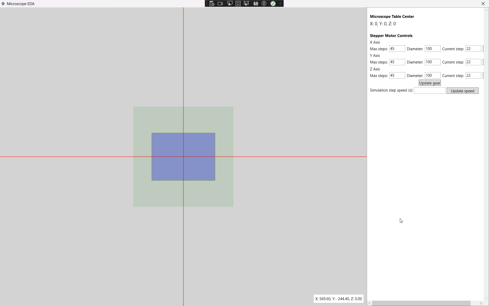

# Microscope EDA

This application is a proof-of-concept simulation top-down view of a microscope table, basically a very simple EDA.

In reality this would control an actual 3-dimensional stepper motor.

The left part is the viewport.

The blue rectanggle represents the microscope table, while the right is the configuration panel.

The green rectangle represents the valid area and is dynamically resized.

The following features are avaiblable:

- **Left click in the view panel**: the microscope table's center moves to the clicked position via animation.
- **Mouse scrolling in the view panel**: the microscope table is lifted up/down.
- **Incrementing the axis in the control panel**: The table is lifted up/down in a predefined way.
- **Live updates**
    - The stepper motor's gears' state is updated in the configuration panel.
    - The center position of the microscope table is updated in the configuration panel.
- **Adjustabe animation speed**: Modifiable in the control panel.
- **Custom gear setup**: The gear parameters can be adjusted based.
- **Robust error handling and user guidance**:
    - In the right bottom side there is a live mouse coordinate tracker. (Can't be seen in the screenshot due to Windows' screenshot being a bit wonky...)
    - The green help area shows clickable positions.
    - If the user clicks *outside* the program notifiers the user about the current state of the simulation and cancels the operation.
    - Before creating a new configuration, the user is prompted, and the operation can be cancelled.
    - If input is invalid, the program notifies the user about it.
    - Multiple level of user notifications: Error, Warning, Info. In case of a UI error, error is explained.
- **Dependency free**: Only uses standard .NET functionality.

To run the standalone version you need the [.NET 8.0 runtime](https://dotnet.microsoft.com/en-us/download/dotnet/8.0).
The standalone version is available in the [releases]() page. You can also list tagged releases.
## Developer notes

- This is targeted for .NET8.
- The project is seperated into a library representing the logic of the microscope table and the components
  and the UI, which usese this library.